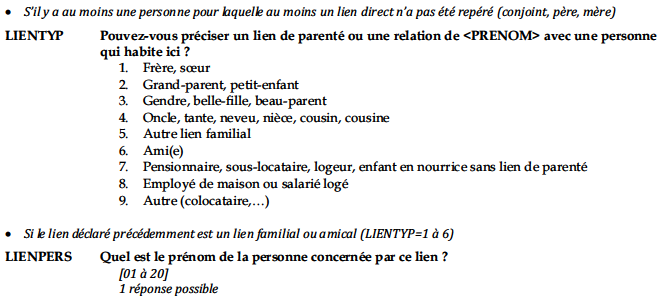

\makethesistitle

```{r setup, include=FALSE}

knitr::opts_chunk$set(echo = FALSE, message = FALSE, warning = FALSE)
source(file = "Code/01a_packages.R") # packages et options par défaut des fonctions
source(file = "Code/01b_fonctions.R") # des nouvelles fonctions utiles ici
infosBDF <- readRDS("Data_output/infosBDF.Rds")
```

\setcounter{tocdepth}{4}

\tableofcontents

\newpage

# Introduction

Accroche rapide :

Construire le cas des familles recomposées : pourquoi c'est intéressant ?

-   Un des cas ou parenté légal, biologique et quotidienne ne sont pas a priori superposé. (Weber)

-   Cas le plus courant, quelques statistiques =\> donc possible d'étudier quantitativement.

-   Donc quand on interroge les arrangement économique dans ces familles sous un angle statistique, c'est pour étudier la forme que peuvent prendre ces arrangement dans les cas ou les différentes dimensions de la parenté ne sont pas parfaitement supperposées.

-   Constitue un cas limite qui permet de questionner les usages de la catgéorie familiales administratives (ménage statitsique, menage pour la caf, foyer fiscal) au prise de l'économie domestique

-   problématique principale : catégories d'état vs catégories familiales ordinaires. Pa seulement montrer qu'il y a un écart, c'est quelque chose qu'on sait et qui est évident/normal, mais pour montrer ce qu'implique cet écart

    -   

        1.  Estimation du niveau de vie dans ces familles
        2.  Interroger les conditions de la mise au travail reproductif : puisque parenté quotidienne et biologique ne sont pas superposées, on peut dénaturaliser la prise en charge du travail domestique
        3.  Interroger les condition de contribution financières aux charges que représentent les enfants : puisque parenté quotidienne et légale ne sont pas
        4.  Effets des catégories administratives et des politiques de redistribution dans ces famille

+------------------------------------------------------------------------------------------------------------------------------------------------------------------------------------------------------------------------------------------------------------------------------------------------------------------------------------------------------------------------------------------------------------------------------------------------------------------------------------------------------------------------------------------------------------------------------------------------------------------------------------------------------------------------------------------------------------------------------------------------------------------------------------------------------------------------------------------------------------------------------------------------------------------------------+
| Consignes mémoire                                                                                                                                                                                                                                                                                                                                                                                                                                                                                                                                                                                                                                                                                                                                                                                                                                                                                                            |
+==============================================================================================================================================================================================================================================================================================================================================================================================================================================================================================================================================================================================================================================================================================================================================================================================================================================================================================================================+
| 1 – Introduction                                                                                                                                                                                                                                                                                                                                                                                                                                                                                                                                                                                                                                                                                                                                                                                                                                                                                                             |
|                                                                                                                                                                                                                                                                                                                                                                                                                                                                                                                                                                                                                                                                                                                                                                                                                                                                                                                              |
| 1.1 - Construction de l’objet (10 pages / 30 000 signes) Revue de littérature française et/ou internationale Énoncé de la question de recherche et développement de la problématique. Annonce du plan et de la logique des différentes parties (« sous-questions »).                                                                                                                                                                                                                                                                                                                                                                                                                                                                                                                                                                                                                                                         |
|                                                                                                                                                                                                                                                                                                                                                                                                                                                                                                                                                                                                                                                                                                                                                                                                                                                                                                                              |
| 1.2 - Présentation des données (3 pages ou 20 pages suivant l’intensité du travail demandé) Choix des sources et modes de collecte de la base de données Base de données originale : Description de l’enquête (sur qui ? sur quoi ?), mode de collecte des données, mode de saisie, apurement de la base… Aspiration de données web : mode d’aspiration, origine et types de données collectées, apurement de la base… Utilisation de bases de données déjà construites, obtenues par l’intermédiaire du Centre Quételet ou d’autres fournisseurs : Détails de l’enquête (sur qui ? sur quoi ?), mode de collecte des données, mode de saisie, apurement de la base… Structure et contenu de la base de données utilisée Date de collecte des données et date de production de la base Population concernée, nombre d’individus Nature des variables utilisées Intérêts et limites des données pour la question de recherche |
|                                                                                                                                                                                                                                                                                                                                                                                                                                                                                                                                                                                                                                                                                                                                                                                                                                                                                                                              |
| **2 - Développement** Suivant les chapitres annoncés dans l’introduction (minimum 2, rarement plus de 5). Dans chaque chapitre : - Quelle est la question traitée ? - Quelles sont les méthodes utilisées permettant d’y répondre ? - Résultats importants (ne pas commenter intégralement les tableaux) - Commentaires et analyse distanciée - Positionnement par rapport à la littérature sur le sujet (compléments, différences, etc). - Discussions sur les précautions à prendre sur l’utilisation des données, sur l’interprétation des méthodes et résultats. - Conclusions : quel est l’apport à la question initiale ? Transition vers chapitre suivant.                                                                                                                                                                                                                                                            |
|                                                                                                                                                                                                                                                                                                                                                                                                                                                                                                                                                                                                                                                                                                                                                                                                                                                                                                                              |
| **3 - Conclusion (3 pages/10 000 signes)** Rappel de la question de départ, des données et des méthodes. Synthèse des principaux résultats. Retour réflexif sur l’apport et les limites du mémoire. Références bibliographiques                                                                                                                                                                                                                                                                                                                                                                                                                                                                                                                                                                                                                                                                                              |
+------------------------------------------------------------------------------------------------------------------------------------------------------------------------------------------------------------------------------------------------------------------------------------------------------------------------------------------------------------------------------------------------------------------------------------------------------------------------------------------------------------------------------------------------------------------------------------------------------------------------------------------------------------------------------------------------------------------------------------------------------------------------------------------------------------------------------------------------------------------------------------------------------------------------------+

## Partie Méthodo dans l'introduction : Les familles recomposées en ménage statistiques

La construction de typologie familiales selon la composition des groupes et la structure des relations entre individus résidant ensemble est un exercice classique en sociologie de la famille [@leplay1874; @durkheim1975; @parsons1968] et en anthropologie sociale [@laslett1983; @goldelier]. Pour ces auteurs, décrire les formes que prennent la famille permet d'analyser l'évolution des relations entre apparentés dans le temps, et plus généralement d'inférer des changements macro-sociologiques. Se faisant, elles tendent à sur ou sous-estimer le caractère nouveau de certaines formes identifiées[^1]. Par ailleurs, comme toute typologie, elles échouent à prendre en compte la diversité des formes familiales ainsi que leur relative fluidité au cours de la vie d'un individu. Il ne s'agit donc pas ici, de proposer une nouvelle typologie des formes familiales, qui prendrait mieux que d'autre la réalité sociologique des familles ou les évolutions récentes de la société, mais simplement de proposer des catégories opérantes pour l'analyse des relations économiques au sein de la famille.

[^1]: C'est d'ailleurs pour cette raison, que l'on préférera parler de familles nucléaires plutôt que de familles traditionnelles pour désigner un couple vivant avec les enfants issus de cette union.

### De la composition familiale à la configuration

#### Familles nucléaires et recomposées en ménage statistique

Alors que dans les années 1970, la monoparentalité est constituée en une catégorie statistique capable d'éclairer l'administration de cette population [@martin-papineau2003], les familles recomposées et les familles nucléaires continuent d'être assimilées dans la plupart des enquêtes statistiques. Avant 1990, la majorité des enquêtes statistiques ne permettent tout simplement pas de les distinguer [@desplanques1993]. Aujourd'hui, si elles sont identifiables, elle ne sont pas *a priori* distinguées des familles nucléaires. La mise en place du tronc commun des enquêtes ménages (TCM), module de questions commun à une grande partie des enquêtes ménages de l'INSEE, a partir de 1990 a participé à l'uniformisation des variables codant les catégories de ménages. Ainsi le type de ménage est généralement codé en cinq catégories héritières de la typologie de @laslett1983 : "Personne seule", "Couple sans enfant", "Couple avec au moins un enfant", "Famille monoparentale", et "Autre type de ménage (ménage complexe)", comme c'est le cas dans l'enquête `r infosBDF$nom` (2017).

```{r TYPMEN5, tab.cap = "Catégories de ménages dans l'enquête BDF", tab.id = "TYPMEN5"}

menages <- readRDS("Data_output/menages.Rds")
dicMenage <- look_for(menages)


# Tableau TYPMEN TCM
dat <- menages %>%
  select(TYPMEN5, PONDMEN) %>%
  rec_TYPMEN5()
dat <- dat %>%
  mutate(TYPMEN5 = TYPMEN5 %>%
            factor(levels = unique(dat$TYPMEN5)) |> 
            fct_infreq()) %>%
  mutate(ENSEMBLE = TRUE) 
var_label(dat$TYPMEN5) <- "Type de ménage (TCM)"
var_label(dat$ENSEMBLE) <- "Ensemble"

datw <- dat %>%
  mutate(PONDMEN = PONDMEN/mean(dat$PONDMEN)) %>%
  as_survey_design(weights = PONDMEN, variables = names(dat)[names(dat) != "PONDMEN"])

tab1 <- datw %>%
  tbl_svysummary(statistic = list(all_categorical() ~ c("{p}")))
tab2 <- datw %>% 
  tbl_svysummary(statistic = list(all_categorical() ~ c("{n_unweighted}"))) 

tab <- tbl_merge(list(tab1, tab2), 
                 tab_spanner = FALSE) %>%
  modify_header(list(label = "", 
                     stat_0_1 = "**Part (en %)**", 
                     stat_0_2 = "**Effectifs non pondérés**")) %>%
  modify_footnote(all_stat_cols() ~ NA)
tab %>%
  as_kable_extra(caption = "Types de ménage selon l'INSEE") %>%
  add_kablesource_note(N = nrow(dat), 
                       lecture = "Parmis les ménages ordinaires résidant en France en 2017, 35% sont des personnes seules.")
```

Cette approche, qui s'intéresse seulement à la composition des ménages et non au liens entre individus ne permet pas de distinguer les familles recomposées des familles nucléaires, elle assimile toutes les couples avec enfants indépendants des liens juridiques, économiques ou affectifs qui unissent ces individus. Elle s'inscrit dans la théorie économique du ménage, qui suppose, qu'il soit composé ou non de plusieurs individus, que le comportement économique du ménage est assimilable à celui d'un individu unique [@donni2011]. En conséquence, les revenus individuels sont considérés comme communs et les dépenses également partagées [@bessière2016]. Dès lors, seule la composition du ménage importe, pour pouvoir appliquer des échelles d'équivalences et rendre ainsi comparables des ménages composés différemment.

#### Distinguer sociologiquement les familles recomposées et les familles nucléaires [ ca va en intro ça non ?]

Cette approche a pour avantage de ne pas présupposer des liens affectifs et économiques différents les familles nucléaires et les familles recomposées, puisque la parenté quotidienne peut ne pas coïncider avec la parenté légale [@weber2013]. Pour autant, en suivant Rémi Lenoir [-@lenoir2003], nous considérons que la famille, en tant que groupe d'individus apparenté par des relations de filiations et/ou d'alliance, ne préexiste pas aux institutions qui objectivent ces relations. Ainsi le droit civil ne les organise pas de la même manière les relations de parenté et les relations entre beaux-parents et beaux-enfants. Il ne définit ni lien de filiation, ni obligation alimentaire entre des enfants et le nouveau ou la nouvelle conjointe d'un de leurs parents, y compris en cas de mariage ou de PACS [@damon2012]. Il n'y a ni obligation d'entretien, comme c'est le cas pour les parents légaux [@delecourt1993], ni facilitation de la transmission de l'héritage comme c'est le cas pour les apparenté.e.s au premier et au second degré [@fulchiron1993]. De ce fait, ni l'économie domestique quotidienne, ni les successions dans les familles recomposées ne peuvent être parfaitement assimilées à celles se déployant dans les familles nucléaires. Les travaux d'Agnès Martial montrent que les cas dans lesquels la logique d'égalité entre tous les enfants des conjoints, quelle que soit leur filiation, préside au moment d'héritage sont rares [@martial1999]. Ainsi, les recompositions familiales ne remettent généralement pas en cause les logiques de lignées fondées sur la filiation établie légalement. L'identification symbolique et affective des enfants aux lignées beau-parentales est elle aussi rare, quand bien mêmes ceux qui y appartiennent font souvent partie de la « famille de référence » [@véron2007]. Les unions civiles (mariages et PACS) se font aussi davantage sous le régime de la séparation de biens lorsqu'une autre union civile a précédé, et lorsque des enfants nés d'une autre union existent [@frémeaux2013]. On peut y voir des arrangements conjugaux visant à protéger mutuellement les intérêts patrimoniaux du nouveau conjoint et des enfants. Ainsi, les relations économiques entre beaux-parents et beaux enfants semblent généralement suivre des logiques différentes de celles entre parents et enfants, et justifient donc un traitement sociologique spécifique des arrangements économiques dans les familles recomposées.

Pourtant, ce n'est généralement pas sous cet angle que la sociologie s'est intéressée aux familles recomposées : A partir des années 1990, sociologues et psychologues s'emparent du sujet des « nouvelles formes familiales » et y voient une « deuxième modernité » familiale [@singly2000; @singly1996; @singly2017]. Ces travaux s'inscrivent dans ce que Céline Bessière et Sibylle Gollac ont nommé « le grand récit de la famille moderne » déjà porté par @durkheim1975 et dont François de Singly, Ulrich Boeck et Anthony Giddens seront les grands continuateurs. Pourtant ces familles -- monoparentales comme recomposées -- ne sont pas radicalement nouvelles. Jusqu'à la seconde guerre mondiale, elles étaient d'avantage liées au décès d'un des conjoints -- du fait de la mortalité élevé des femmes notamment en couche et des hommes lors des périodes de guerre -- qu'a une séparation [@flandrin1984]. Leur relative nouveauté tient moins à l'existence de beau-parent, qu'a l'existence, en même temps, des deux parents. En d'autres termes, en théorie, la recomposition se fait moins selon un *modèle de substitution* qu'un *modèle de pérennité* [@clément2005]. Ainsi, Le cas des familles recomposée nécessite de considérer la pluralité des logements dans lesquels les recompositions se déploient pour sortir de la logique procédant par réduction à la résidence principale.

Si l'on reprend donc le tryptique entre familles monoparentales, familles nucléaires et familles recomposées hérité de la sociologie de la famille des années 2000, c'est bien moins parce que ces catégories serait mieux adaptées à la société actuelle que parce que nous considérons ces familles comme un cas sociologique au sens de @passeron2020 pour observer la continuation de l'ordre du genre après la séparation conjugale. S'intéresser aux familles recomposées implique donc d'une part de sortir d'une analyse à l'échelle du ménage pour s'intéresser à ce qui se passe, d'un point de vue matériel, en son sein et à l'extérieur. D'autre part, cela suppose aussi de sortir d'une logique d'analyse par la composition du ménage pour s'intéresser aux relations économiques, légales et administratives qui unissent les individus qui le composent.

#### Etudier les liens familiaux en sociologie quantitative

Si les grandes enquêtes de l'INSEE ne proposent généralement pas de variables permettant de distinguer les familles nucléaires des familles recomposées, le Tronc Commun des enquêtes Ménages (TCM) a permis de récolter systématiquement des informations sur les liens entre les individus d'un même ménage. Dans l'enquête `r infosBDF$nom` (2017), pour chaque individu, est renseigné les liens entretenus avec chaque autre individus.

```{r}
dic <- readRDS("Documentation/Dictionnaire_individu.rds")

var <- "LIEN01-20"
label <- dic %>%
  filter(Variable_nom == var) %>%
  select(Variable_description) %>%
  unique()
dic %>%
  filter(Variable_nom == var) %>%
  select(Modalite_code, Modalite_label) %>%
  rename(`Valeur` = Modalite_code, `Modalite` = Modalite_label)%>%
  kbl(caption = paste0("Codage de la variable ", var, " : ", label)) %>%
  kable_styling("condensed", font_size = 8) %>%
  row_spec(0, bold = T) %>%
  footnote(paste0("Source : Dictionnaire des codes de l'enquête ", infosBDF$nom, ", ", infosBDF$vague, ". "))

  
```

A priori, les liens entre beau-parent et beaux-enfants sont renseignées (modalitées 31 et 32), c'est d'ailleurs ce que nous avons pensé - non sans éprouver le a joie - en consultant le dictionnaire des codes en juin dernier. Cependant, en y regardant de plus près ces deux modalités désignent en fait les relations avec la belle-famille, c'est-à-dire les parents du conjoint.



Une fois encore, l'absence modalité cette modalité de réponse témoigne de l'impensé que constitue ce type de relations dans la statistique publique. Pour autant, à partir des seuls liens d'alliance et de filiation renseignés (liens parentaux et conjugaux), il est possible de reconstruire ces relations, et donc d'identifier les ménages dans lesquels un couple vit avec au moins un enfant qui n'est pas issu de leur union.

Par ailleurs, il ne suffit pas de s'intéresser aux liens entre les individus appartenant à un même ménage ou même a un unique logement, puisque la famille peut déborder ce cadre [@toulemon2011; @bonvalet2003]. L'enquête `r infosBDF$nom`, donne justement un certains nombre d'informations sur les parents des individus, y compris lorsqu'ils ne vivent pas avec eux.

```{r, fig.cap= "Situations des parents"}
indiv <- readRDS("Data_output/indiv.Rds")

dat <- indiv %>%
  select(PER1E, MER1E, IDENT_MEN, PONDIND) %>%
  mutate(
    PER1E = case_when(
      PER1E == "1" ~ "Cohabitant", 
      PER1E == "2" ~ "Non-cohabitant", 
      PER1E == "3" ~ "Décédé", 
      PER1E == "4" ~ "Inconnu"), 
    MER1E = case_when(
      MER1E == "1" ~ "Cohabitante", 
      MER1E == "2" ~ "Non-cohabitante", 
      MER1E == "3" ~ "Décédée", 
      MER1E == "4" ~ "Inconnue")
  ) %>%
  mutate(ENSEMBLE = TRUE)

var_label(dat$MER1E) <- "Mère"
var_label(dat$PER1E) <- "Père"
var_label(dat$ENSEMBLE) <- "Ensemble"

# dat <- filter(dat, !is.na(MER1E) & !is.na(MER1E))

datw <- dat %>%
  as_survey_design(weights = PONDIND, 
                   ids = "IDENT_MEN",
                   variables = names(dat)[!(names(dat) %in% c("PONDIND", "IDENT_MEN"))])

tab1 <- datw %>%
  tbl_svysummary(statistic = list(all_categorical() ~ c("{p}%")))
tab2 <- datw %>% 
  tbl_svysummary(statistic = list(all_categorical() ~ c("{n_unweighted}"))) 

tab <- tbl_merge(list(tab1, tab2), 
                 tab_spanner = FALSE) %>%
  modify_header(list(label = "", 
                     stat_0_1 = "**Part**", 
                     stat_0_2 = "**Effectifs non pondérés**")) %>%
  modify_footnote(all_stat_cols() ~ NA)

tab %>%
  as_kable_extra(caption = "Présence des parents dans le logment") %>%
  add_kablesource_note(N = nrow(dat), 
                       lecture = "Parmis les individus vivant en ménages ordinaires en France en 2017, 23% vivent avec leur père")
```

En croisant donc les deux variables ci dessus, nous pouvons identifier les familles monoparentales en distinguant les cas ou l'autre parent réside ailleurs des cas ou celui-ci est décédé ou inconnu. L'enquête `r infosBDF$nom` fournit également des informations sur les enfants vivants hors du domicile de leurs parents grâce à une table de données spécifiques à ces individus.

```{r}

enfantsHD <- readRDS("Data_output/enfHD.Rds")

dat <- enfantsHD %>%
  select(HODCO, IDENT_MEN, PONDIND) %>%
  mutate(HODCO = case_when(
    HODCO == "1" ~ "Dans son propre logement", 
    HODCO == "2" ~ "En logement collectif (cité universitaire, foyer, internat,...)", 
    HODCO == "3" ~ "Chez son père ou sa mère", 
    HODCO == "4" ~ "Logé ailleurs")) %>%
  mutate(ENSEMBLE = TRUE)

var_label(dat$HODCO) <- "Lieu de résidence de l'enfant vivant hors-domicile"
var_label(dat$ENSEMBLE) <- "Ensemble"

# dat <- filter(dat, !is.na(MER1E) & !is.na(MER1E))

datw <- dat %>%
  as_survey_design(weights = PONDIND, 
                   ids = "IDENT_MEN",
                   variables = names(dat)[!(names(dat) %in% c("PONDIND", "IDENT_MEN"))])

tab1 <- datw %>%
  tbl_svysummary(statistic = list(all_categorical() ~ c("{p}%")))
tab2 <- datw %>% 
  tbl_svysummary(statistic = list(all_categorical() ~ c("{n_unweighted}"))) 

tab <- tbl_merge(list(tab1, tab2), 
                 tab_spanner = FALSE) %>%
  modify_header(list(label = "", 
                     stat_0_1 = "**Part**", 
                     stat_0_2 = "**Effectifs non pondérés**")) %>%
  modify_footnote(all_stat_cols() ~ NA)

tab %>%
  as_kable_extra(caption = "Lieu de résidance des enfants vivant hors domicile") %>%
  add_kablesource_note(N = nrow(dat), 
                       champ = paste0("Enfant résidant hors domicile d'un de leur parent vivant en", infosBDF$champ),
                       lecture = "Parmis les enfants vivants hors domicile d'un de leur parent en 2017, 38% vivaient chez l'autre parent")

```

On peut ainsi identifier les parents n'ayant pas la garde principale de leur enfant résidant chez l'autre parent.

### La situation des enfants : le point de départ des constructions de catégories

Introduction sur l'Enfant qui fait famille [ref de singly, enfant qui fait famille] et les pratiques usuelles dans la statistique publique =\> approche pare les enfant. Ce que ça véhicule comme manière de voir la famille, et pourquoi est ce que nous ce qui nous intéresse c'est moins la situation des enfants que celles des parents. On reprend cette démarche pour des question de comparabilité (trouver des références); On regarde ce qui se passe pour les enfants, non pas pour regarder quelles sont leurs conditions de vies à eux, mais pour comprendre quelles logiques sont à l’œuvre entre conjoints

#### Qu'est ce qu'un enfant ?

Avant d'essayer d'identifier la situation familiale des enfants, il nous faut d'abord définir ce qu'on entend par "enfant". D'un point de vu sociologique, il n'est pas si aisé de circonscrire cette catégorie d'individus : "enfant" désigne tout aussi bien l'appartenance à une classe d'âge, un statut civil et pénal - celui de mineur -, et une position des rapports entre générations familiales. D'un point de vue de la statistique publique, un enfant est "*une personne célibataire, qui n'est pas en couple avec une personne de son ménage (au sens des enquêtes auprès des ménages), ayant un parent (père ou mère) dans son ménage, et n'étant pas lui-même parent (père ou mère) d'une personne de son ménage*". Aucune limite d'âge n'étant fixée, l'INSEE privilégie donc une définition de l'enfance comme position dans les rapports familiaux au sein du ménage.

Dans l'enquête `r infosBDF$nom` on dénombre ainsi

```{r}

enfantsMenage <- readRDS("Data_output/enfantsDuMenage.Rds")


```

#### Des enfants à la famille

```{r, include = FALSE}
# Digramme de Venn

famillesToutes <- readRDS("Data_output/famillesToutes.Rds")

famillesToutes <- famillesToutes %>%
  filter(if_any(starts_with("Configuration"), ~ (.x %% 2) == 0))

famillesToutes <- famillesToutes %>%
  mutate(PONDMEN = PONDMEN / mean(PONDMEN))

datadiag <- list(
  Traditionelle = famillesToutes[famillesToutes$`Configuration traditionelle` & 
                          !is.na(famillesToutes$`Configuration traditionelle`) , "IDENT_MEN"] %>%
    unlist() %>%
    as.list(),
  Recomposée = unique(c(famillesToutes[famillesToutes$`Configuration recomposée maternelle` & 
                             !is.na(famillesToutes$`Configuration recomposée maternelle`), "IDENT_MEN"],
            famillesToutes[famillesToutes$`Configuration recomposée paternelle` & 
                             !is.na(famillesToutes$`Configuration recomposée paternelle`), "IDENT_MEN"])) %>%
    unlist() %>%
    as.list(),
  Monoparentale = unique(c(famillesToutes[famillesToutes$`Configuration monoparentale maternelle` & 
                                     !is.na(famillesToutes$`Configuration monoparentale maternelle`), "IDENT_MEN"],
                    famillesToutes[famillesToutes$`Configuration monoparentale paternelle` & 
                                     !is.na(famillesToutes$`Configuration monoparentale paternelle`), "IDENT_MEN"])) %>% 
    unlist() %>%
    as.list()
)

library(nVennR)

p <- plotVenn(datadiag)
regs <- listVennRegions(p) %>%
  names() %>%
  str_sub(1, 7) %>%
  str_split(", ")

for(i in 1:length(regs)){
  reg <- as.numeric(regs[[i]])
  ew <- NULL
  ew[i]<- sum(famillesToutes[famillesToutes$IDENT_MEN %in% getVennRegion(p, as.numeric(reg)), "PONDMEN"])
  pw <- NULL
  pw[i] <- ew[i]/sum(famillesToutes[, "PONDMEN"]) 
  pw[i] <- round(pw[i]*100, 1)
  ew[i] <- round(ew[i], 1)
  p <- setVennRegion(p, as.numeric(reg), 
                     value = ew[i]) 
}

p <- plotVenn(nVennObj = p)
showSVG(nVennObj = p, outFile = "illustrations/Vendiag.svg", borderWidth = 0, labelRegions = F, fontScale = 1.3)

```

#### de la famille aux parents

### Se remmetre en couple quand on a des enfants

#### [provisioire] Situer socialement les remises en couple

-   couple cohabitant ou non

-   enfants hors domicile ou non

------------------------------------------------------------------------

-   construction socio-historiques des catégories de ménages TCM etc.. (couple avec enfant vs failles monoparentales)

-   problèmes des frontières du ménage

-   Recodages effectuée : approche par les enfants (discussion de cette approche)

-   Limites des Recodages effectués

=\> une fois qu'on a fait ça, on a pas gagner parce que le

------------------------------------------------------------------------

# Chapitre 1. Le calcul du niveau de vie à l'épreuve des configuration familiales recomposées

> *Je ne sais pas si cette sous partie ira à la fin du I ou au début du II, et ça pourrait mËme aller en fin du II ou en début du III. il s'agit de dire que le niveau de vie est mal estimé dans les familles recomposées, ce qui est pour plusieurs raisons et que cela à plusieurs conséquences. Donc probablement si ca reste ici c'est pour des raisons de type d'interrogation méthodologique (ici on est pls sur des questions de statistiques et de mesure*) et dans ce cas on le pose comme ressort problématique, avec un II qui cherche a fournir une explication et un III qui cherche à expliciter les conséquences. , mais ça peut aller au début du II parce que ce qui suit explique cela, ça peut aller à la fin du II parce que c'est la conséquence de ce qu'on explique dans le II

## Le niveau de vie, un indicateur statistique central

Qu'il s'agisse de comparer des pays, de quantifier des inégalités économiques entre individus ou encore d'analyser la consommation, le niveau de vie est un indicateur central en sciences sociales. Calculé comme le quotient du revenu disponible d'un ménage sur le nombre d'unités de consommation de celui-ci, il permet de rendre comparable des ménages composées différemment. Pour cela, il s'appuie sur des échelles d'équivalence, qui attribuent un coefficient à chaque personne supplémentaire en fonction de ses caractéristiques propre. Ce coefficient correspond ainsi à la proportion de revenu supplémentaire que le ménage doit gagner pour cet individu, afin de bénéficier du même niveau de vie qu’une personne seule.

```{r}
echellesEquivalences <- NULL
```

\*\* INSERER tableau des échelles d'équivalences \*\*

Le calcul du niveau de vie est également au fondement des dispositifs de redistribution. Les administrations sociales et fiscales possèdent donc elles aussi leurs propres échelles d'équivalences, parfois spécifiques à chaque prestation.

-   Plus les limites

Des limites nombreuses, évolutions de la structure des budgets, donc économies d'échelles qui bougent aussi (exemple du logement)

comparaisons internationales qui ne prennent pas en compte le niveau de démarchandisation (services publics, redistrib en "nature", ex dépenses de santé France vs USA)

Les familles recomposées : la question des limites du ménage

### Estimer les niveaux de vie

------------------------------------------------------------------------

\tiny

Dans l'enquête BDF 2017, trois variables subjectives permettent d'approcher des estimations du niveau de vie dans les familles.

------------------------------------------------------------------------

\normalsize

## Des structures de consommation proches des familles nucléaires

```{r, include = FALSE}

familles <- readRDS("Data_output/famillesToutes.Rds")
conso <- readRDS("Data_output/conso.Rds")
names(conso) 

types_conso <- c(paste0("0", 1:9), 10:12) 


conso2 <- lapply(types_conso, function(x){
  tab <- conso %>%
    select(starts_with(paste0("C", x)))
  tab <- rowSums(tab, na.rm = TRUE)
  consotot<- conso$CTOT %>% as.vector()
  tab <- (tab/consotot)*100
  return(tab)
  }
)

conso2 <- conso2 %>%
  bind_cols() %>%
  as.data.frame()

names(conso2) <- c("PRODUITS ALIMENTAIRES ET BOISSONS NON-ALCOOLISEES ", 
                   "BOISSONS ALCOOLISEES, TABACS ET STUPEFIANTS ", 
                   "ARTICLES D’HABILLEMENT ET CHAUSSURES", 
                   "LOGEMENT, EAU, GAZ, ELECTRICITE ET AUTRES COMBUSTIBLES", 
                   "MEUBLES, ARTICLES DE MENAGE ET ENTRETIEN COURANT DE LA MAISON", 
                   "SANTE", 
                   "TRANSPORTS", 
                   "COMMUNICATIONS", 
                   "LOISIRS ET CULTURE", 
                   "ENSEIGNEMENT", 
                   "RESTAURATION ET HÔTELS", 
                   "BIENS ET SERVICES DIVERS") %>% 
  str_to_sentence()

 

conso2$`Consommation finale` <- conso$CTOT

names(familles)
data <- familles %>%
  bind_cols(conso2) %>%
  select("PONDMEN", "n_configMenage", all_of(names(conso2))) 

```

```{r}
data %>%
  as_survey_design(weights = "PONDMEN") %>%
  select(-PONDMEN) %>%
  tbl_svysummary(by = "n_configMenage", 
                 statistic = list(all_continuous() ~"{mean}"), 
                 type = list(everything() ~ "continuous"),
                 missing = "no") %>%
  add_overall(last = T) %>%
  add_p()
```

## Un niveau de vie subjectif qui s'éloigne de l'indicateur dans les familles recomposées

```{r}

```

#### Couple parental, parent célibataire ou nouvelle union, des effets différenciés sur le niveau de vie ressenti

#### Les mères de familles recomposées estiment leur niveau vie plus faible

#### Les pères de famille recomposées estiment leur niveau de vie plus élevé

# Chapitre 2. Ce qu'on compte mal : Des inégalités de revenus, de dépenses et de consommation

## Les budgets des ménages, une difficile individualisation

### De l'unité de compte et d'enquête à la catégorie statistique

En 2020, une nouvelle nomenclature des professions et catégories sociales (PCS) est instaurée. Elle introduit en particulier une PCS « ménage » chargée de mieux rendre compte de la position sociale du ménage et non plus seulement de celle de la « personne de référence » du ménage, qui donnait de fait, la préséance à la position professionnelle de l’homme. Codée par une opération de synthèse des catégories socioprofessionnelles (CSP) des deux membres du couple lorsqu’il existe, cette refonte ne change pas fondamentalement de perspective. Le ménage reste une unité de base, forcément assimilable à un individu, sur laquelle se fonde la majorité des enquêtes représentatives de la population résidant en France conduites par l’institut national pour la statistique et des études (INSEE). Ce travail cherchera à faire une histoire de la quantification du ménage statistique et à soulever quelques interrogations qui en résultent. Il s’appuiera principalement sur l’intervention d’Olivier Martin à propos de son ouvrage L*’Empire des chiffres* publié en 2020 aux éditions Armand Colin dans le cadre du séminaire Fabrique des Données. On analysera la fabrique de la catégorie de « ménage » au prisme des leçons tirées de son travail. Son intervention sera complétée par la lecture du chapitre 4 « La mise en statique des sociétés » de cet ouvrage. Les travaux de Thomas Amossé, qui a beaucoup écrit sur le ménage, seront aussi mobilisés dans ce cadre. En particulier, le dossier thématique du numéro 26 de la revue *Genre, travail et société* « Les individus font-ils bon ménage ? » qu’il a coordonné avec Sophie Ponthieux constituera une ressource majeure. Ce travail s’inscrit donc pleinement dans une sociologique de la quantification. Plus ponctuellement, on s’appuiera aussi sur les autres séances et interventions du séminaire tant la question du ménage intervient dans beaucoup d’enquêtes.

En reprenant Olivier Martin, lorsqu’il s’exprime sur les apports de la sociologie de la quantification, la quantification suppose un travail de « construction de catégories de pensée et de classification concrètes » par lequel est circonscrit un phénomène, avant de pouvoir le quantifier. Le ménage fait partie de ces catégories de pensée, tellement ancrées dans les pratiques statistiques qu’elles sont rarement interrogées. Support des techniques d’échantillonnage, unité de compte, catégorie d’analyse, le « ménage » reste aux cœurs de la production de données. Il ne va pourtant pas de soi, ni dans la forme actuelle qu’il prend, ni dans son existence même. C’est cette construction historique que l’on voudrait retracer ici. À la fin du XIX^ème^ et au début XX^ème^ siècle, les statistiques vont progressivement s’autonomiser des demandes ponctuelles des administrations pour se routiniser[[1]](#_ftn1). À cette occasion, le ménage apparaît comme l’instrument de l’uniformisation des récoltes statistiques. Il se diffuse dans les enquêtes, qui se font plus régulières. Pourquoi le ménage devient-il cette unité de base ? Pourquoi une autre unité, comme l’individu ou l’entreprise, ne s’impose-t-elle pas comme unité principale ? En reprenant Olivier Martin, ce travail de construction mêle des aspects à la fois matériels, immatériels et cognitifs. Sans prétendre répondre définitivement à cette question, étudier ces différents aspects de la construction du ménage comme unité d’enquête, de compte et comme catégorie permet de donner quelques pistes.

**De la catégorie administrative à la catégorie statistique : naissance d’une unité de compte et d’enquête**

Au XIVe siècle, alors que les ancêtres des premiers recensements sont mis en place, des listes de « feux » sont constituées[[2]](#_ftn2). En comptant les « feux », on compte les foyers, les logements, autour desquelles les groupes familiaux vivent. Ces inventaires servent à constituer une base permettant le prélèvement de l’impôt[[3]](#_ftn3). En France, après la révolution, l’impôt est d’abord assis sur le logement et la propriété foncière (pour trois des « quatre vielles »), ce qui explique que le recensement compte les logements[[4]](#_ftn4). Après la Première Guerre mondiale, la mise en place d’un impôt sur le revenu progressif en lieu et place de la proportionnalité de la contribution personnelle et mobilière impose de considérer la familialisation de celui-ci[[5]](#_ftn5). Si les premiers recensements s’intéressent déjà à la composition du logement, déterminer qui appartient ou n’appartient pas au groupe familial devient alors un enjeu administratif. Un tableau ordonnant les individus en fonction des liens qu’ils entretiennent avec le chef de ménage doit être rempli par celui-ci : femme, enfants, ascendants, domestiques. Ce « *système de la liste nominative fait de la famille l’unité de compte du recensement* » disent Thomas Amossé et Gaël de Peretti[[6]](#_ftn6). Le ménage est donc, dès le début, attaché à la fois au logement et à la famille, et sa genèse est imbriquée dans celle du foyer fiscal. En d’autres termes, les catégories de la pratique statistique sont dès le début celles de la pratique administrative. Selon Olivier Martin, ces premières enquêtes constituent des techniques d’Etat : « *ces enquêtes ne sont pas liées à des préoccupations d’ordre scientifique : il ne s’agit pas d’établir des connaissances savantes sur les faits économiques, démographiques ou sociographiques. La visée est pragmatique* »[[7]](#_ftn7).

Pour autant, le ménage n’est pas qu’une simple traduction d’une catégorie administrative dans l’appareil statistique, il répond aussi aux préoccupations spécifiques au déploiement et au renforcement de celui-ci.  Au début du XX^ème^ siècle, au fur et à mesure que les enquêtes se font plus routinières et thématisées, on cherche à limiter les coûts de celles-ci. Les progrès mathématiques en probabilités favorisent le développement des techniques d’échantillonnages. Ces techniques permettent d’enquêter moins d’individus tout en conservant la représentativité de l’enquête[[8]](#_ftn8). Ce sont les recensements qui vont servir de base de sondage de sorte que ce ne sont pas les individus mais les ménages qui sont alors tirés au sort. Le logement apparaît aussi comme un lieu d’enquête commode pour les enquêteurs. Aujourd’hui encore, comme le soulignait François Beck dans son intervention sur le développement du multimode dans les enquêtes de l’INSEE, les enquêtes CAPI à domicile sont à la fois les plus coûteuses et celles qui donnent les meilleurs résultats en termes de taux de réponse et de précision des données recueillies. Le ménage est donc aussi une unité d’enquête qui correspond à organisation matérielle de la production des données. Enfin, le ménage est une unité de compte qui permet d’étudier des caractéristiques donc on veut s’économiser l’individualisation : logement, budget, niveau de vie. D’une unité de compte et d’enquête, le ménage devient une catégorie statistique. Il faut alors établir des critères d’identification et de délimitation.

                **Définition et redéfinitions du ménage**

Loin de constituer une catégorie figée des statistiques publiques, la définition du ménage varie considérablement dans le temps. Thomas Amossé et Gaël de Peretti parlent ainsi d’une « *valse à trois temps* »[[9]](#_ftn9) dont on reprend ici la chronologie. Dès sa formulation, la définition d’un ménage suppose l’identification d’un chef de ménage[[10]](#_ftn10) permettant d’attribuer au ménage les caractéristiques de celui-ci et ainsi de faciliter les comparaisons entre ménages. La composition du ménage est certes interrogée, mais toujours définit *par rapport* au « chef de ménage ». Ce chef est alors un représentant, au sens social comme au sens statistique du terme, de l’ensemble des individus du ménage auquel il appartient. Le chef de ménage est d’abord désigné comme le chef de famille au sens du droit civil, et donc dans la majorité des cas, l’homme. Le ménage est alors une catégorie statistique appuyée sur la définition juridique de la famille. Après la Seconde Guerre mondiale, le ménage est progressivement distingué de la famille mais aussi du logement[[11]](#_ftn11), pour se centrer sur le budget commun. Avec la création de l’INED en 1945 et de l’INSEE en 1946, une division du travail d’analyse du ménage s’instaure ces deux instituts[[12]](#_ftn12). Les économistes s’intéressent aux hommes, seuls considérés comme aptes à répondre aux questions sur le travail et l’emploi, les démographes s’intéressent aux femmes, uniquement interrogées sur leur rôle reproductif et familial. En suivant Thomas Amossé et Gaël de Peretti, « *l’histoire des outils et institutions statistiques (entre Ined et Insee) est aussi l’histoire du jeu de ces domaines réservés* »[[13]](#_ftn13). En assignant a priori des rôles sexués aux hommes et femmes enquêtés, cette conception du ménage ne permet pas de rendre compte de leurs évolutions. Cet « âge d’or » de l’enquête par ménage se termine dans les années 1970 devant l’échec des enquêtes statistiques à voir la montée fulgurante de l’activité féminine.

À partir des années 1970, se construit un individu statistique. Les enquêtes se font toujours par ménage, mais ce sont bien les individus qui sont interrogés et plus seulement comme des représentants. Les questionnaires sont alors identiques qu’il s’agisse d’un homme ou d’une femme et le sexe de l’individu devient une variable parmi d’autres. C’est le cas par exemple des enquêtes Patrimoine ou Budget de famille. Le « chef de ménage » devient celui qui se désigne comme tel, et peut donc théoriquement être une femme. À partir du recensement de 1982, à l’arbitraire de cette désignation, est substitué l’établissement d’une « personne de référence », désignée par l’enquêteur selon plusieurs critères[[14]](#_ftn14). Ces critères, choisis pour imiter au mieux le choix habituel du « chef » des ménages enquêtés, donnent la préséance aux hommes s’ils sont en couple, et aux individus actifs et âgés. Dans les faits, 96,3% des « personnes de références » sont les mêmes que les « chefs de ménages » auto-désignés. Ceci implique d’identifier dans les logement différents ménages et dans les ménages différents noyaux familiaux. En suivant Olivier Martin, les statistiques « *participent très directement à la construction des représentations du monde social et économique : ils façonnent la société en participant à l'invention de nouvelles catégories de perception et d’action* »[[15]](#_ftn15). Sur la période, la conception du ménage se transforme, transformant par la même les représentations scientifiques du monde social.  Ainsi, dans l’exploitation des enquêtes, la logique change aussi. Les comparaisons statistiques s’effectuent alors d’avantage entre individus qu’entre ménage : on met en lumière des « inégalités » entre hommes et femmes[[16]](#_ftn16).

À la fin des années 1990, s’amorce un mouvement qui cherche à ouvrir la « boite noire du ménage » et qui n’est pas encore terminé aujourd’hui. Dès les années 1980 à l’INED, les démographes s’intéressent non plus seulement aux différences entre hommes et femmes, mais aux relations entre ceux-ci dans les familles. D’une approche macro-sociale qui permettait de comparer les foyers entre eux en après-guerre puis les individus entre eux à partir des années 1970, on passe à une approche plus microsociale attentive aux rapports sociaux internes aux familles. Le ménage reste une unité d’enquête, mais il est conçu différemment : d’une unité de production et consommation qui produit une fiction d’homogénéité et d’égalités entre individus, il devient un « système d’allocation des ressources »[[17]](#_ftn17). Depuis 2004, la notion d’ « unité de vie »  présente dans le Tronc commun des ménages (TCM, ensemble de questions posées à tous les ménages enquêtés par l’INSEE) , signe « *la déconnexion désormais possible entre le logement, le budget et la famille* »[[18]](#_ftn18). Le TCM permet également de connaître la position précise des individus dans le ménage enquêté. L’unité de compte est donc individuelle, mais elle est articulée à la catégorie de ménage. De l’aveu de Thomas Amossé et Gaël de Peretti, cette dernière représentation du ménage peine encore à s’ancrer dans les pratiques statistiques.

Le ménage n’est donc pas un « impensé » statistique, il a été continuellement redéfini. Pour autant, cela ne signifie pas que sa conception actuelle soit satisfaisante pour saisir les rapports sociaux de sexe. La PCS ménage, aussi conçue pour répondre aux critiques féministes de celui-ci, introduit quelques nuances en prenant davantage en compte la position sociale des femmes. Par exemple, les concepteurs de la réforme, dont Thomas Amossé fait partie, ont souligné son utilité, comparée à d’autres critères donnant de fait ou de droit la préséance au travail masculin (personne de référence, principal apporteur de ressource) pour rendre compte des trajectoires scolaires des enfants. La PCS ménage « *donnent à voir des différences importantes au sein des enfants de cadres, de professions intermédiaires et de classes populaires, en fonction de la profession de l’autre parent* »[[19]](#_ftn19). Pour autant, on se demande ce qu’apporte réellement la PCS ménage, dans le cas des trajectoires scolaires, par rapport à la PCS et au diplôme de la mère, dont on savait déjà qu’ils expliquent mieux les trajectoires scolaires des enfants que ceux du père[[20]](#_ftn20). La réforme des PCS, en cherchant à positionner socio-professionnellement un ménage, conduit dans le cas des couples, à synthétiser en une dimension ce qui, dans les faits, en a nécessairement deux. De ce fait, elle contribue à masquer les antagonismes sociaux de sexe.

[[1]](#_ftnref1) Olivier Martin, « Chapitre 4. La mise en statistiques des sociétés » dans *L’empire des chiffres : une sociologie de la quantification*, Malakoff, France, Armand Colin, 2020, p. 73‑103.

[[2]](#_ftnref2) *Ibid.*

[[3]](#_ftnref3) Thibaut Saint-Pol, Aurélie Deney et Olivier Monso, « Ménage et chef de ménage : deux notions bien ancrées », *Travail, genre et societes*, 2004, N° 11, n^o^ 1, p. 63‑78.

[[4]](#_ftnref4) Nicolas Delalande et Alexis Spire, *Histoire sociale de l’impôt*, Paris, La Découverte, 2010, 128 p.

[[5]](#_ftnref5) Clément Carbonnier, « Prise en compte de la famille dans l’imposition des revenus en France », *Revue francaise d’economie*, 10 août 2016, Volume XXXI, n^o^ 1, p. 111‑152.

[[6]](#_ftnref6) T. Saint-Pol, A. Deney et O. Monso, « Ménage et chef de ménage », art cit, p. 66.

[[7]](#_ftnref7) O. Martin, « Chapitre 4. La mise en statistiques des sociétés », art cit, p. 77.

[[8]](#_ftnref8) Alain Desrosiéres, *La Politique des grands nombres. Histoire de la raison statistique*, París, La Découverte, 2000.

[[9]](#_ftnref9) Thomas Amossé et Gaël De Peretti, « Hommes et femmes en ménage statistique : une valse à trois temps », *Travail, genre et societes*, 4 novembre 2011, n° 26, n^o^ 2, p. 23‑46.

[[10]](#_ftnref10) T. Saint-Pol, A. Deney et O. Monso, « Ménage et chef de ménage », art cit.

[[11]](#_ftnref11) A partir de 1946, les liens entre le chef de ménage et les autres membres de celui-ci ne sont plus nécessairement des liens familiaux. A partir de 1954, plusieurs ménages peuvent cohabitent dans un même logement.

[[12]](#_ftnref12) T. Amossé et G.D. Peretti, « Hommes et femmes en ménage statistique », art cit.

[[13]](#_ftnref13) *Ibid.*, p. 27.

[[14]](#_ftnref14) Jean-Pierre Courson, « Les ménages n’auront plus de chef », *Economie et Statistique*, 1982, vol. 149, n^o^ 1, p. 47‑55.

[[15]](#_ftnref15) O. Martin, « Chapitre 4. La mise en statistiques des sociétés », art cit, p. 96.

[[16]](#_ftnref16) T. Amossé et G.D. Peretti, « Hommes et femmes en ménage statistique », art cit.

[[17]](#_ftnref17) *Ibid.*, p. 39.

[[18]](#_ftnref18) *Ibid.*, p. 41.

[[19]](#_ftnref19) Thomas Amossé et Joanie Cayouette-Remblière, *La construction d’une PCS ménage. Synthèse des travaux du sous-groupe 3*, Paris, INSEE, 2019, p. 22.

[[20]](#_ftnref20) François de Singly, *Fortune et infortune de la femme mariée: sociologie de la vie conjugale*, Paris, France, Presses Universitaires de France, 2004, 229 p.

### Un "cache-sexe" des pratiques économiques

### Saisir l'économie domestique dans les enquêtes ménages

-   Le ménage commune unité de base des enquête, donc compliqué d'avoir acces aux pratiques qui se déploient à l'interieur de celui ci

-   Donc on ne peut pas a priori indiivudaliser les dépenses, c'ets le ménage qui consomme

-   Quelques dépenses individualisables

-   L'usage des variables subjectives

-   les arrangements avec la fiscalité

Idées que les pratiques des différents adultes sont différenciées

keys : lignée vs maisonnée, travail

#### Les pratiques des parents dans les familles recomposées

### Mais des dépenses spécifiques aux enfants qui différents

```{r, eval = FALSE}

familles <- readRDS("Data_output/famillesToutes.Rds") 
conso <- readRDS("Data_output/conso.Rds") 
names(conso)  
types_conso <- list(   Scolaire = names(conso)[str_starts(names(conso), "C111|C112")],    Vetements = names(conso)[str_starts(names(conso), "C03123|C03213")],    Jouets = names(conso)[str_starts(names(conso), "C09311")],    Garde = names(conso)[str_starts(names(conso), "C124111|C056211")],   Alimentation = names(conso)[str_starts(names(conso), "C011941")],    Mobilier = names(conso)[str_starts(names(conso), "C051164")])  conso2 <- lapply(types_conso, function(x){   tab <- conso %>%     select(starts_with(paste0("C", x)))   tab <- rowSums(tab, na.rm = TRUE)   consotot<- conso$CTOT %>% as.vector()   tab <- (tab/consotot)*100   return(tab)   } )  conso2 <- conso2 %>%   bind_cols() %>%   as.data.frame()  names(conso2) <- c("PRODUITS ALIMENTAIRES ET BOISSONS NON-ALCOOLISEES ",                     "BOISSONS ALCOOLISEES, TABACS ET STUPEFIANTS ",                     "ARTICLES D’HABILLEMENT ET CHAUSSURES",                     "LOGEMENT, EAU, GAZ, ELECTRICITE ET AUTRES COMBUSTIBLES",                     "MEUBLES, ARTICLES DE MENAGE ET ENTRETIEN COURANT DE LA MAISON",                     "SANTE",                     "TRANSPORTS",                     "COMMUNICATIONS",                     "LOISIRS ET CULTURE",                     "ENSEIGNEMENT",                     "RESTAURATION ET HÔTELS",                     "BIENS ET SERVICES DIVERS") %>%    str_to_sentence()     conso2$`Consommation finale` <- conso$CTOT  names(familles) data <- familles %>%   bind_cols(conso2) %>%   select("PONDMEN", "n_config", all_of(names(conso2)))  data$n_configMenage <- data$n_configMenage %>%   fct_relevel(     "Couple sans enfant", "Femme seule", "Homme seul", "Mère célibataire",     "Père célibataire", "Mère en couple", "Père en couple", "Parents en couple",     "Autre type de ménage (ménage complexe)"   )  data %>%   as_survey_design(weights = "PONDMEN") %>%   select(-PONDMEN) %>%   tbl_svysummary(by = "n_config",                   statistic = list(all_continuous() ~"{mean}"),                   type = list(everything() ~ "continuous"),                  missing = "no") %>%   add_overall(last = T) %>%   add_p()                   
```

### Des beaux-parents aux pratiques différenciées

Décrire socialement les beaux-parents

#### La mise au travail domestique des belles mères

#### Des beaux-pères qui contribuent plus faiblement

### Des ex-conjoint.e.s moins mobilisé.e.s

# Chapitre 3. Ce qu'on ne compte pas : Travail domestique et autoproduction.

\listoftables

\listoffigures

\newpage

# Bibliographie
